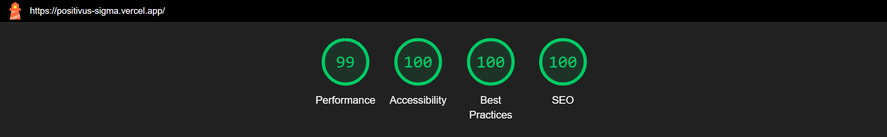
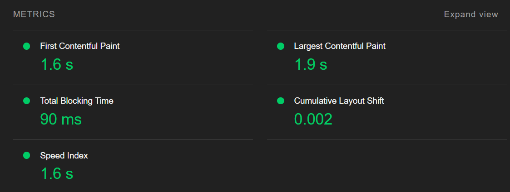
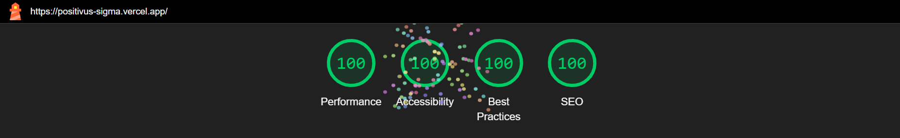
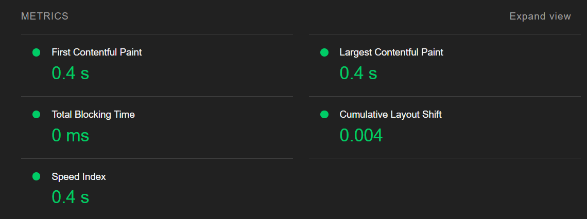

# Positivus

Positivus is a modern and fully responsive landing page built with Vite and React. This project is a conversion of the [Positivus Figma Design](https://www.figma.com/design/fS4nn7wsOoyc18XpeczT3S/Positivus-Landing-Page-Design-\(Community\)?node-id=403-333\&p=f\&t=3t3tJaoHVTCGUpjj-0) into a functional website, featuring an interactive slider and optimized performance.

---

## Figma Design

This project is based on the **Positivus Figma Design**, which provides a sleek and modern UI layout. The design was carefully translated into a fully functional and optimized website while maintaining visual fidelity.

[View the Figma Design](https://www.figma.com/design/fS4nn7wsOoyc18XpeczT3S/Positivus-Landing-Page-Design-\(Community\)?node-id=403-333\&p=f\&t=3t3tJaoHVTCGUpjj-0)

---

## Technologies Used

- **Vite** - For fast and efficient development
- **React** - For building the user interface
- **Slider.js** - For interactive and smooth sliding functionality
- **Vanilla CSS** - For styling and responsiveness

---

## Features

- **Fully Responsive** - Works seamlessly across all devices
- **Interactive Slider** - Smooth and engaging user experience
- **Optimized Performance** - Built with Vite for fast load times
- **Modern UI** - Clean and minimalistic design
- **Lazy Loading** - Improves page speed by loading images only when needed

---

## Lighthouse Performance Report

Below are the Lighthouse audit results for both mobile and desktop views:

### Mobile Performance



### Desktop Performance



---

## Installation & Usage

### Clone the Repository

```sh
 git clone https://github.com/realrnvr/Positivus
```

### Install Dependencies

```sh
cd Positivus
npm install
```

### Start Development Server

```sh
npm run dev
```

### Build for Production

```sh
npm run build
```

---

## License

This project is licensed under the MIT License.

---

## Contact

For inquiries or contributions, reach out via GitHub Issues.
